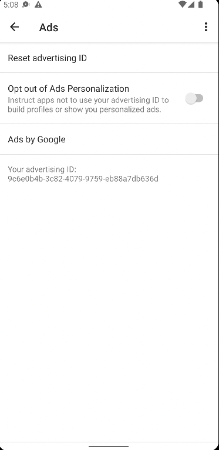
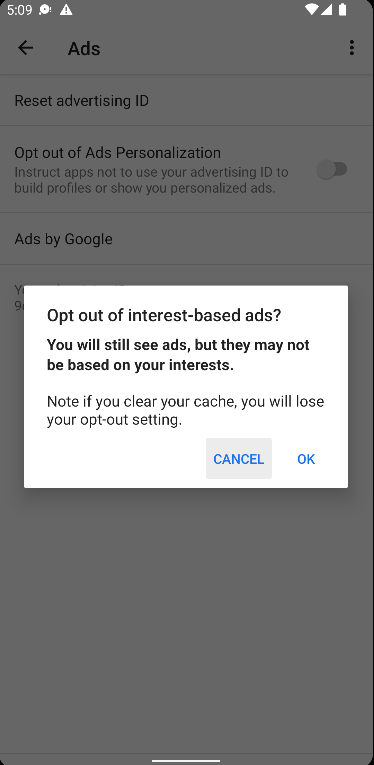
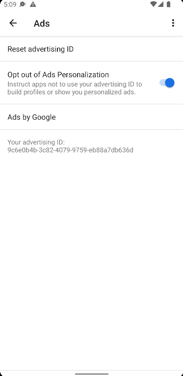
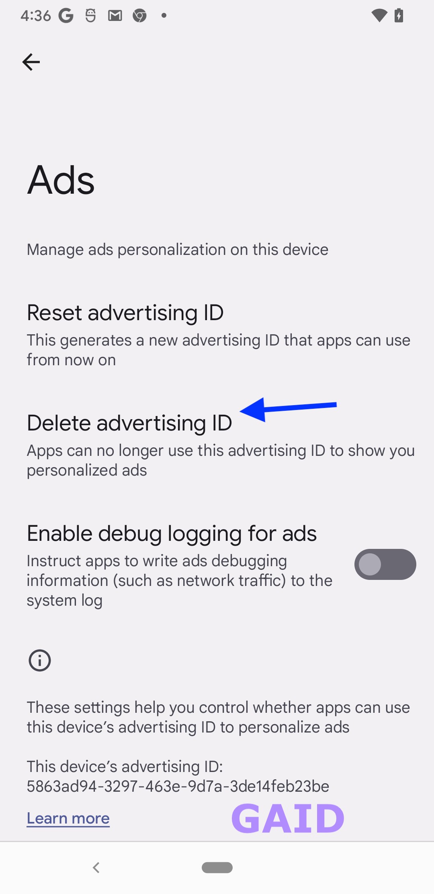
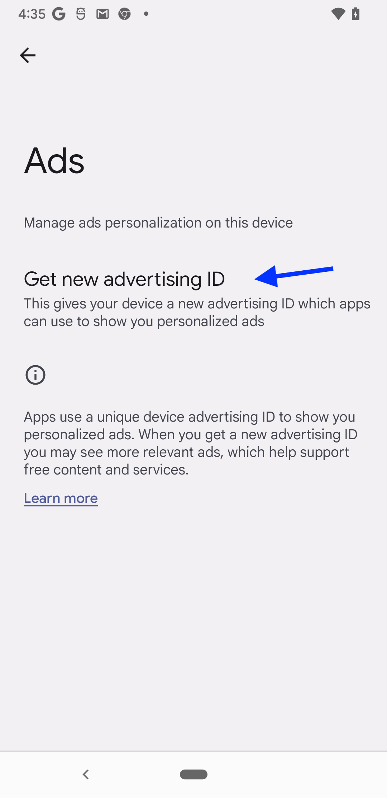

# Getting started with the test app

## Testing tips for Android advertising identifier
See Google's [Advertising ID help article](https://support.google.com/googleplay/android-developer/answer/6048248?hl=en) for the latest requirements to access ad ID through `AdvertisingIdClient` APIs.

Developers using ad ID should get the value from the API each time it is used, as permissions for ad tracking and/or the value of the ID itself may be changed at any time.

To detect and handle changes in ad ID value or tracking authorization state, it may be helpful to use:
- A getter helper method that all requests for ad ID value are routed through.
- A check in the app lifecycle foreground event (or equivalent).

In some Android environments, the ad ID tracking authorization is controlled using a toggle where the existing ad ID value remains unchanged:

[](./assets/old_adid_setting_optin.png)
[](./assets/old_adid_setting_optout_prompt.png)
[](./assets/old_adid_setting_optout.png)

Based on Android emulator (Pixel_3a_API_32_arm64-v8a) testing for the ad ID toggle view using the Google Mobile Ads Lite SDK:
- Ad ID settings can be accessed through the device settings: Settings -> Privacy -> Ads. On this page:
    - Users are opted-in to ad ID tracking by default.
    - The ad ID value can be reset; this option replaces the old value with a new one.
    - Ad tracking authorization status can be changed using the toggle.
    - The ad ID value can be viewed.
- There is no ad tracking permission prompt shown to the user on first app launch.
- Changes in ad tracking authorization status or ad ID value do not terminate the app.
- When ad tracking is limited, the Mobile Ads Lite SDK still returns the device's current valid ad ID,
therefore using the [`isLimitAdTrackingEnabled()`](https://developers.google.com/android/reference/com/google/android/gms/ads/identifier/AdvertisingIdClient.Info#isLimitAdTrackingEnabled()) API to determine tracking authorization status before accessing ad ID value is recommended. See Google's API reference on [`getId()`](https://developers.google.com/android/reference/com/google/android/gms/ads/identifier/AdvertisingIdClient.Info#public-string-getid) for the latest guidance on accessing the ad ID value and expected return values.

In other Android environments, the ad ID tracking authorization is controlled using a delete option that replaces the existing ad ID value with an all-zeros value until it is recreated by user's selection:

[](./assets/new_adid_setting_optin.png)
[](./assets/new_adid_setting_optout.png)

## Android Ads SDKs
## Google Mobile Ads Lite SDK
The [Google Mobile Ads Lite SDK](https://developers.google.com/admob/android/lite-sdk) is a way to use ads APIs without including the full size [Google Mobile Ads SDK](https://developers.google.com/admob/android/quick-start).  
See API reference for [`AdvertisingIdClient`](https://developers.google.com/android/reference/com/google/android/gms/ads/identifier/AdvertisingIdClient) and [`AdvertisingIdClient.Info`](https://developers.google.com/android/reference/com/google/android/gms/ads/identifier/AdvertisingIdClient.Info); the latter provides the APIs for getting the ad ID value and tracking authorization status.

The Google AdMob SDK requires an application ID specified in the `AndroidManifest.xml` when the SDK is included in the build, otherwise the app will crash. However, for just ad ID testing purposes, the SDK doesn't have to be initialized. See Google's [quick start guide](https://developers.google.com/admob/android/quick-start#import_the_mobile_ads_sdk) for a detailed implementation guide (and a free sample app ID provided by Google for testing purposes in step 3).

#### Implementation example
Using a getter to return the ad ID value. Key points to note:
- Use of a background coroutine scope from the call site.
- Checking the ad tracking authorization status to return the appropriate ad ID value.
```kotlin
import android.content.Context
import android.util.Log
import com.google.android.gms.ads.identifier.AdvertisingIdClient
import com.google.android.gms.common.GooglePlayServicesNotAvailableException
import com.google.android.gms.common.GooglePlayServicesRepairableException
import java.io.IOException

/**
* Async method that retrieves the ad ID from the `AdvertisingIdClient.Info` (from Google's Mobile Ads Lite SDK).
* Sanitizes ad ID tracking disabled state and any exceptions to the empty string (`""`), for easy use with `MobileCore` ad ID APIs.
* Should *only* be called from a background thread/coroutine.
*
* @param applicationContext: The application context that has the advertising ID provider to obtain the ad ID from.
* @return ad ID string: the ad ID value from the provider if available and tracking is allowed, empty string otherwise.
*/
suspend fun getGAID(applicationContext: Context): String {
    var adID = ""
    try {
        val idInfo = AdvertisingIdClient.getAdvertisingIdInfo(applicationContext)
        if (idInfo.isLimitAdTrackingEnabled) {
            Log.d(LOG_TAG, "Limit Ad Tracking is enabled by the user, setting ad ID to \"\"")
            return adID
        }
        Log.d(LOG_TAG, "Limit Ad Tracking disabled; ad ID value: ${idInfo.id}")
        adID = idInfo.id
    } catch (e: GooglePlayServicesNotAvailableException) {
        Log.d(LOG_TAG, "GooglePlayServicesNotAvailableException while retrieving the advertising identifier ${e.localizedMessage}")
    } catch (e: GooglePlayServicesRepairableException) {
        Log.d(LOG_TAG, "GooglePlayServicesRepairableException while retrieving the advertising identifier ${e.localizedMessage}")
    } catch (e: IOException) {
        Log.d(LOG_TAG, "IOException while retrieving the advertising identifier ${e.localizedMessage}")
    }
    Log.d(LOG_TAG, "Returning ad ID value: $adID")
    return adID
}
```
Call site:
```kotlin
 // Create IO (background) coroutine scope to fetch ad ID value
val scope = CoroutineScope(Dispatchers.IO).launch {
    val adID = sharedViewModel.getGAID(context.applicationContext)
    Log.d(LOG_TAG, "Sending ad ID value: $adID to MobileCore.setAdvertisingIdentifier")
    MobileCore.setAdvertisingIdentifier(adID)
}
```

Required normal permissions to use ad ID (Android 13 and above):
```xml
<uses-permission android:name="com.google.android.gms.permission.AD_ID"/>
```
For more specifics on the use of this permission in the context of Android version requirements and permission merging through SDKs, see the [AdvertisingIdClient.Info documentation](https://developers.google.com/android/reference/com/google/android/gms/ads/identifier/AdvertisingIdClient.Info).

## AndroidX Ads SDK
Overview: https://developer.android.com/jetpack/androidx/releases/ads  
See the overview for official releases; the latest version is still in alpha and may not be fully supported.  
`AdvertisingIdClient` API reference: https://developer.android.com/reference/androidx/ads/identifier/AdvertisingIdClient  

Based on testing with SDK version 1.0.0-alpha04 on emulator Pixel_3a_API_32_arm64-v8a, the SDK's [`AdvertisingIdClient.isAdvertisingIdProviderAvailable(Context)`](https://developer.android.com/reference/androidx/ads/identifier/AdvertisingIdClient#isAdvertisingIdProviderAvailable(android.content.Context)) does not return `true`, even when a valid app `Context` is provided. See additional source: https://stackoverflow.com/questions/59217195/how-do-i-use-or-implement-an-android-advertising-id-provider  
Following the guide for ad ID may therefore not work: https://developer.android.com/training/articles/ad-id  
